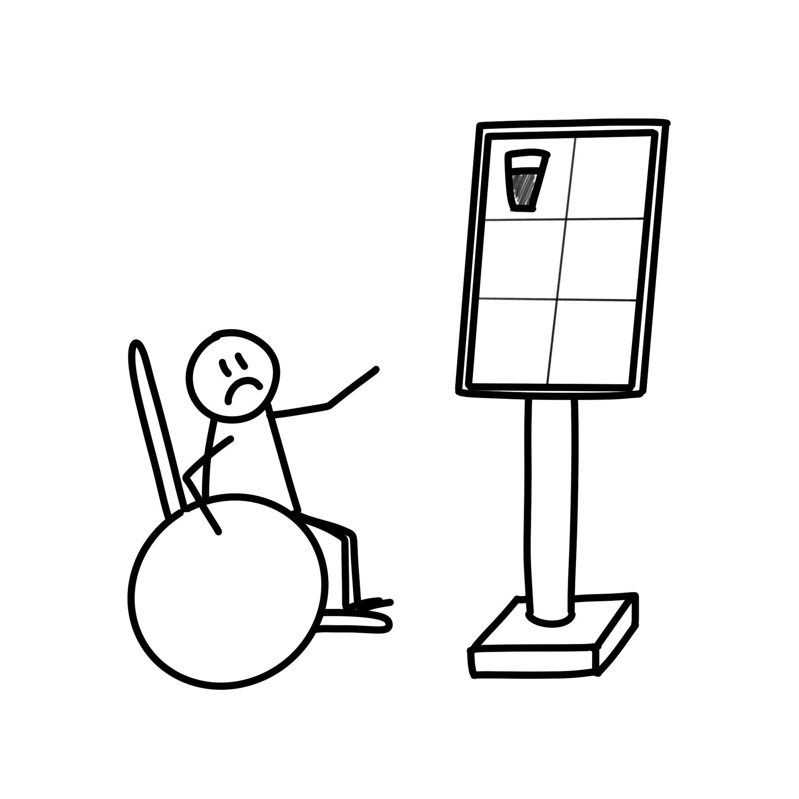
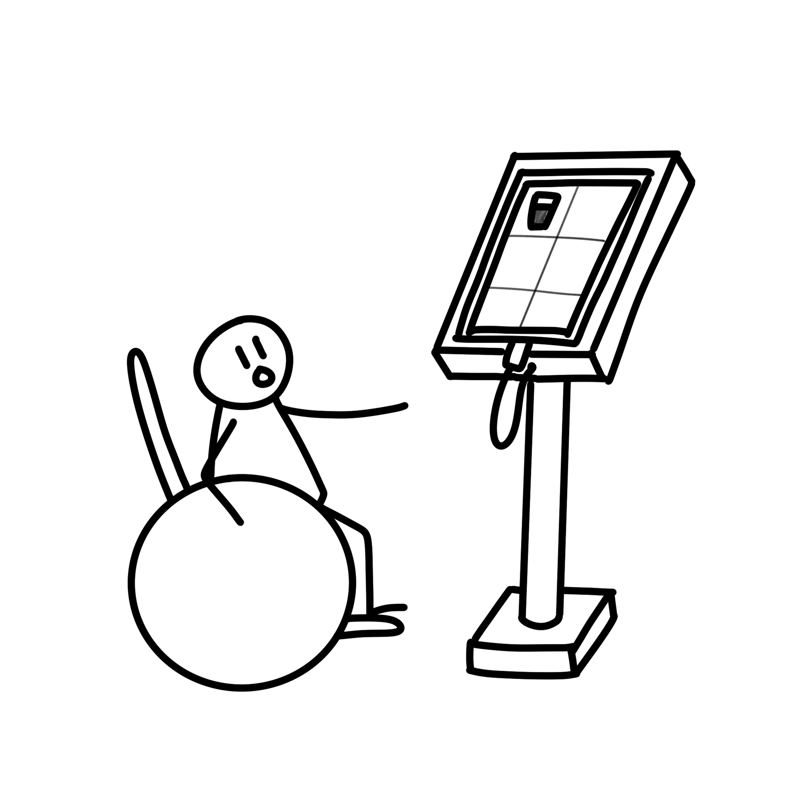
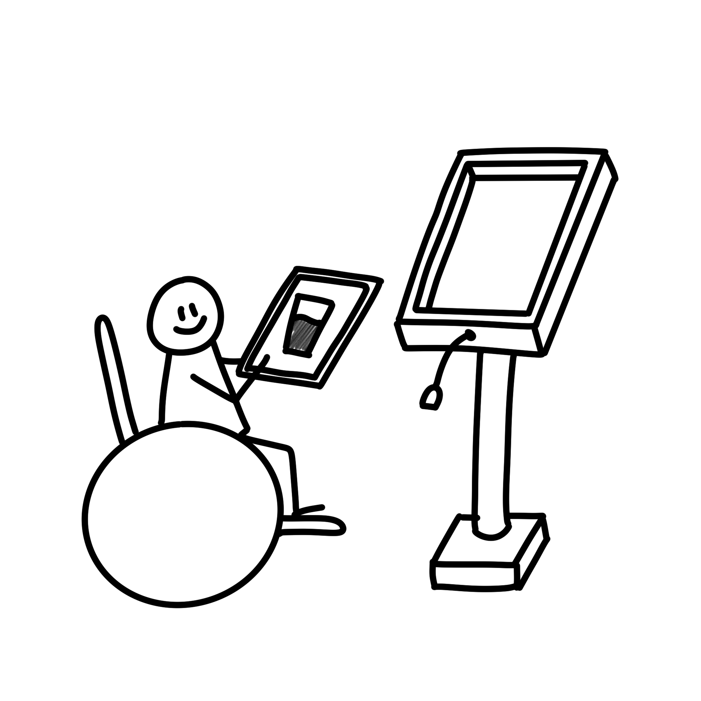
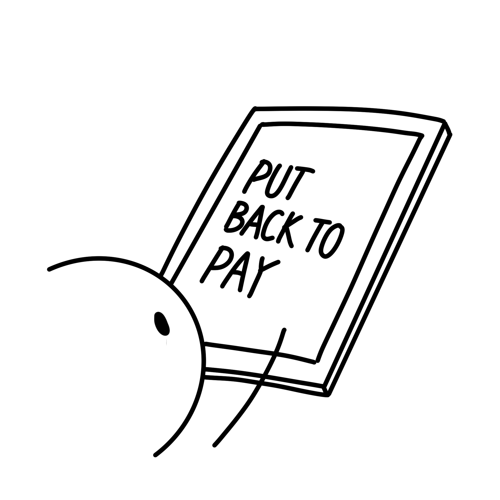
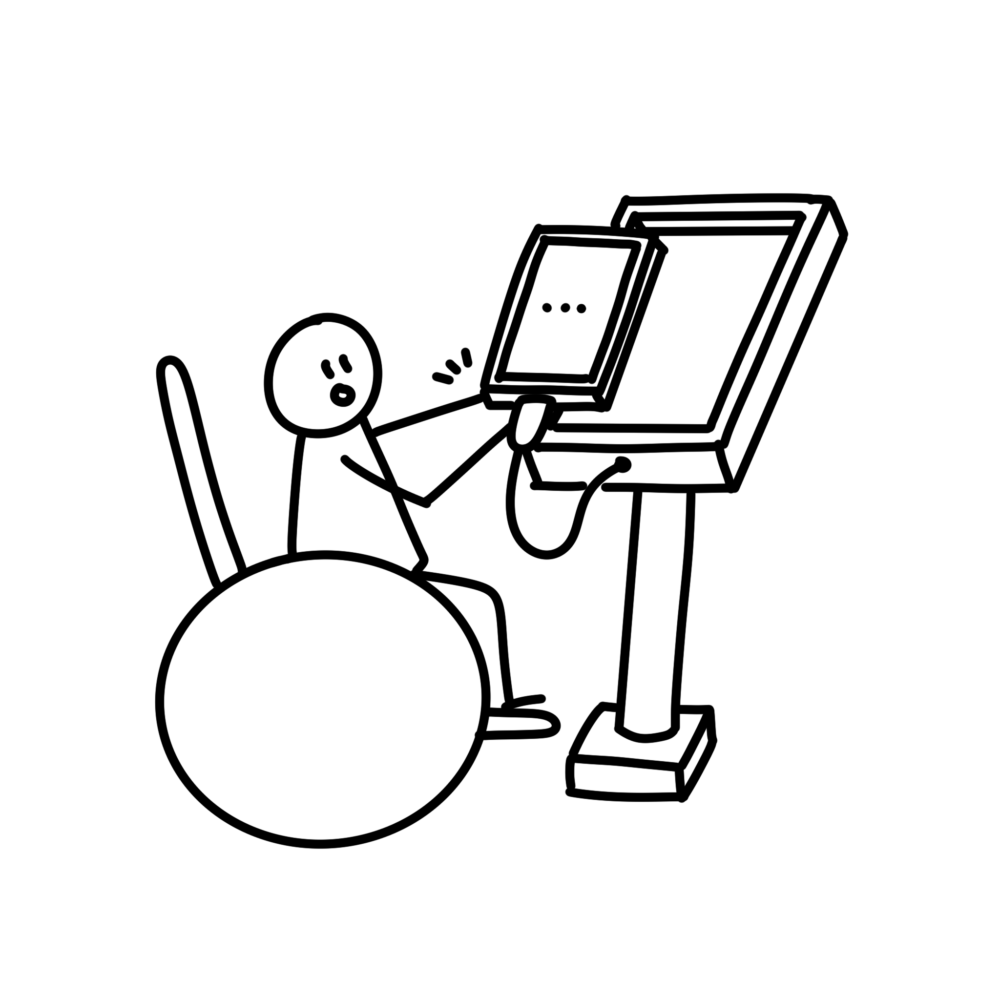
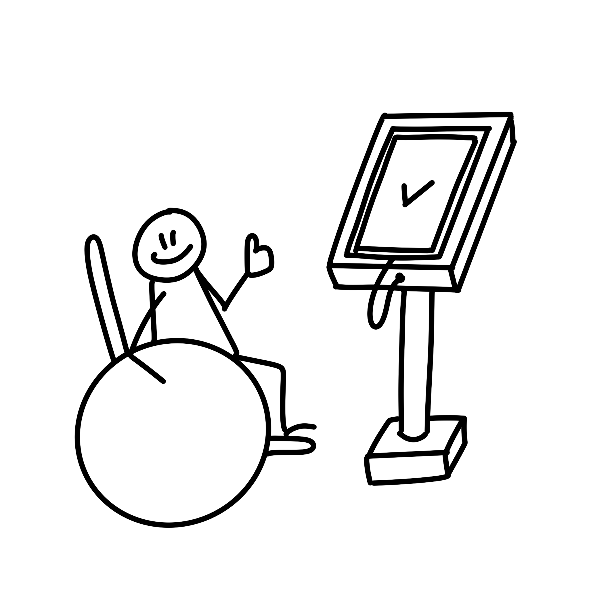
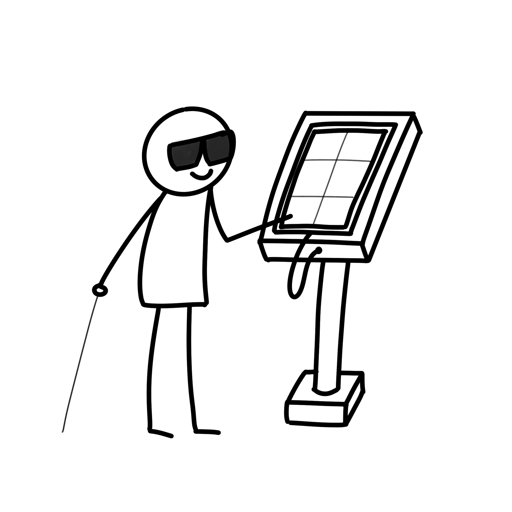
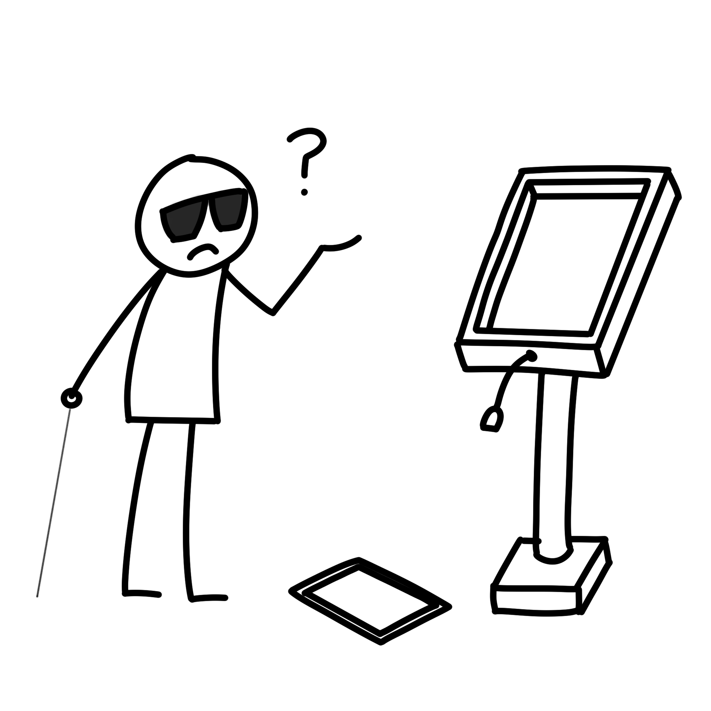

# Barrier Free Kiosk
Human-Computer Interaction (HCI) team project  

# Motivation
Kiosk is rapidly increasing nowadays, many people use it  
But there are many blind spots, hard to using for barrier people  
So, our team suppose some concepts to mitigate barriers or blind spots  

## Note
Note that, our team's prototype is not fully providing all features
Like code, UI etc might be unstable, not fully-implemented  

# How to install & use

## Install
[Link]() - not available now  
## Configuration
Ref file [example_config.json](./example_config.json)  
<details>
<summary>Detailed explanation</summary>

```json
{
    "category": [ <- category section
        {
            "title": "category name", <- category name like, pizza pasta beverage
            "items": [0], <- index of items
            "details": [[]] <- detail index for each items
        }
    ],
    "details": [ <- detail section
        [ <- first detail configuration
            {
                "name": "detail name like, nothing", <- first item of current detail
                "price": 0
            },
            {
                "name": "add ice", <- second item of current detail
                "price": 0
            }
        ]
    ],
    "items": [ <-item section
        { <- first item
            "name": "item name", <- item name
            "price": 1000, <- item price
            "images": "image path (relative path)", <- item image path
            "description": "description of item, this will be used in recommendation system" <- item description for natural language processing
        }
    ]
}
```
</details>

## Start Application
Install application  
Set config.json and image directory  


## For development
```powershell
git clone https://github.com/devhoodit/barrier-free-kiosk-app.git
cd barrier-free-kiosk
```
Current developing on 13.5 Freeform API 33 (android-x64 emulator)

# Propose
Our team use 키오스크(무인정보단말기) 이용실태 조사 to analyze problems  
Our targets are
- Elders (Digital Abbreviation)  
- Blinds
- Lower extremity disorders
- Kiosk Customers
- Developers

We propose several concepts
- [Consistency](#consistency)
- [Recommendation System](#recommendation-system)
- [Freedom](#freedom)
- [Restrict](#restrict)
- [Cost](#cost)
- [Compatibility](#compatibility) 
- [Sccability](#scalabilty)


## Consistency
First, so many types of kiosk in many place, inconsistent UI design can confuse people  
So, provide consistent UI form  
This UI form is based on [Material Design Guide](https://m3.material.io/), since we experience a lot of UI design based on material design guide that is friendly  

## Recommendation System
See reference, older people tend to prefer the recommendation system, vice versa  
Our goal is decreasing accessibility for youngers, increasing for elders  
Providing recommendation system is annoying for youngers but providing better experience for elders  
This will lead to situtation youngers use default (no recommendation system kiosk), elders use barrier free kiosk (recommendation system kiosk)  
This mean mainly customer is focused on our targest not for normal people (not our target)  
This recommendation system will be implemented with Natural Language Processing  

## Freedom
Common kiosk is fixed in position  
We will use tablet PC as a kiosk, tablet can be fixed or freely moved in hand  
Then why we give freedom to table PC move?  
For lower extremity disorders, sight height and action radius, they just get tablet PC and order with it  

## Restrict
This section is quite similar with consistency  
With freedom, comes responsibility  
Consider some situation when people do not put in place after use kisok  
This might give low UX for people and specially, for blind people, put in right place is very important  
For consistency initial state for every situation, we will restrict last state  
Then how we restrict last state? we restrict "pay" part.
Pay only works in "pluged-in" state, pay is last part of kiosk ordering phase  
So after ordering, tablet kiosk might be in right place  

<details>
<summary>Open to see situation</summary>




</details>

## Cost
Cost is also important thing to supply barrier fress kiosk  
Common barrier free kiosk cost is too expensive, so the barrier to entry is high for some managers  
But, as we propose, tablet PC is very cheap compared to default kiosk (not only barrier free kiosk also common kiosk)   
When we investigate kiosk cost, common kiosk cost is about 750~1500$, barrier free kiosk cost is about 20k$, but tablet PC is about 450$ (we use samsung tab S7 FE for this project)  
This only about install cost (CapEX), we also need to consider about maintenance cost (OpEX)  
Tablet is common thing, not only for kiosk also we use in real-life, so, like A/S, maintenance cost is understandable  
(And time for maintenance also has good condition)  

## Compatibility
Not only for android platform or specific device, we want to provide compatibility  
So we use [Flutter](https://flutter.dev/) that provide multi-platform like, mobile (android, ios), PC application, Web, embedded  
And also flutter provide material widgets  
In this prototype, not support many compatibility  

## Scalabilty
First, what is scalability?  
In some specific kiosk, they need some special device for processing (like fingerprint reader)  
Tablet PC is scalable with C-type port or networking  
If need hardware device, connect C-type port to use (networking too)  
Also, tablet basically provide some hardware like camera  

# Prototype Limitation
Not fully-implemented  

# How it works
## configuration

# Special Thanks
[@4ch1o3](https://github.com/4ch1o3) - Drawing sketches that describes specific situation for better explanation