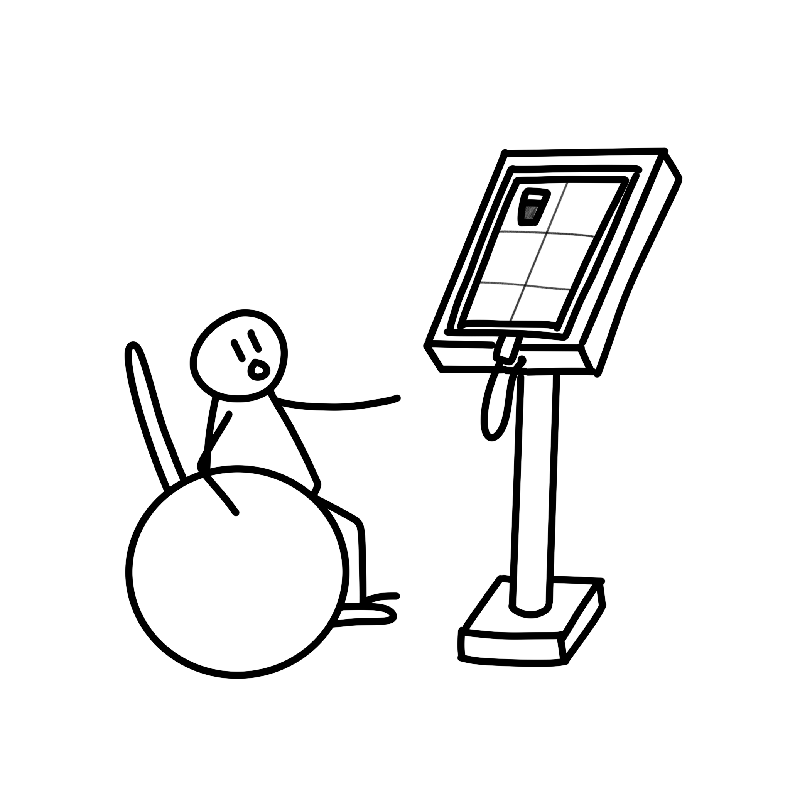
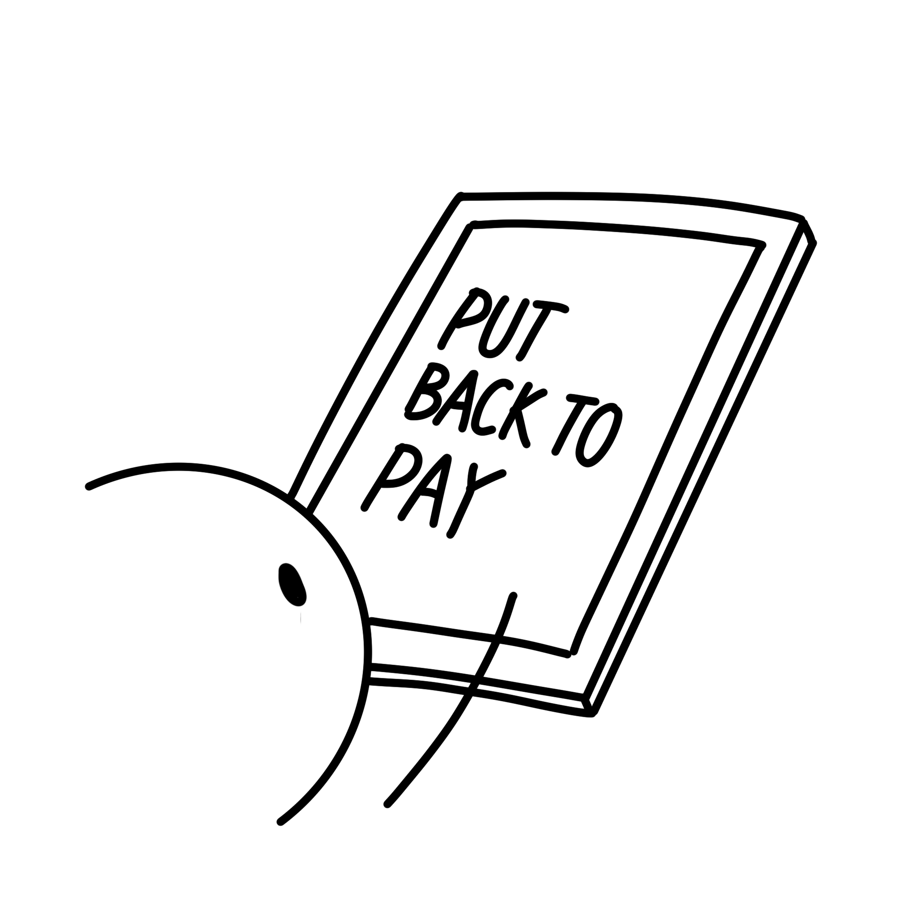
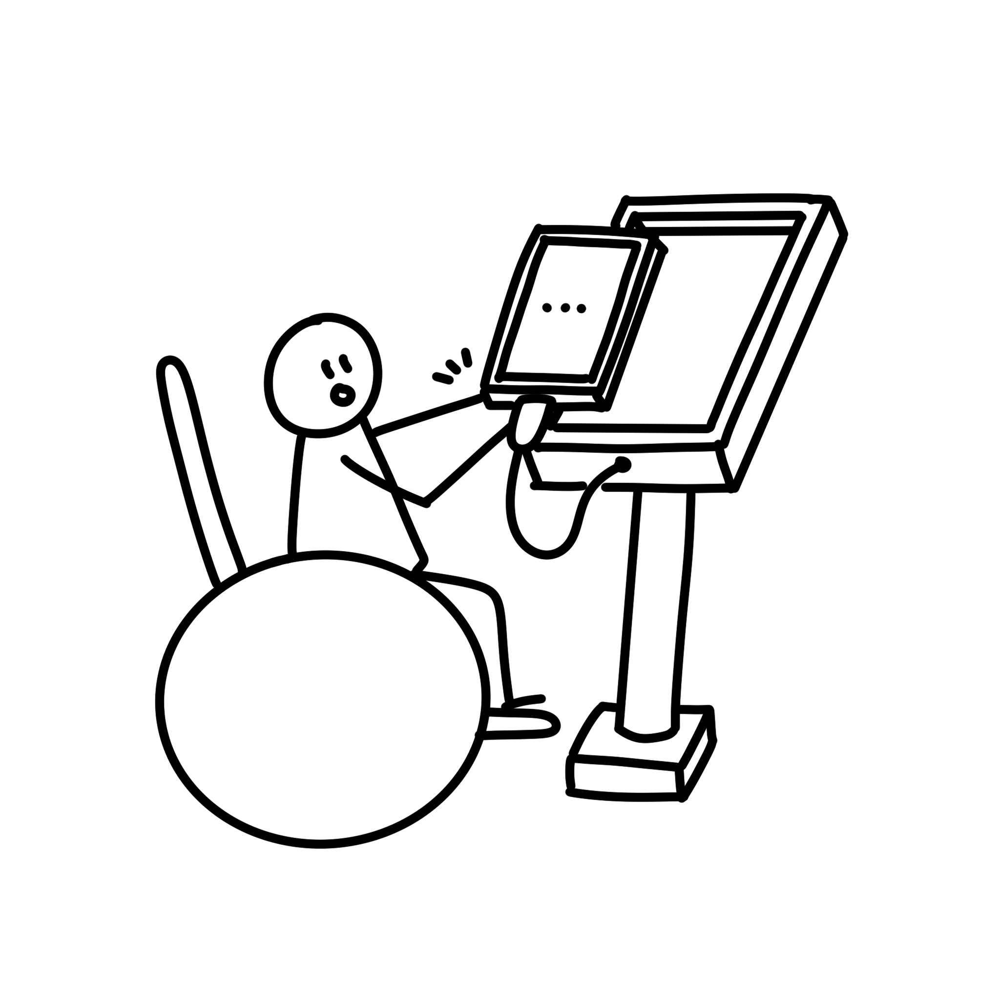
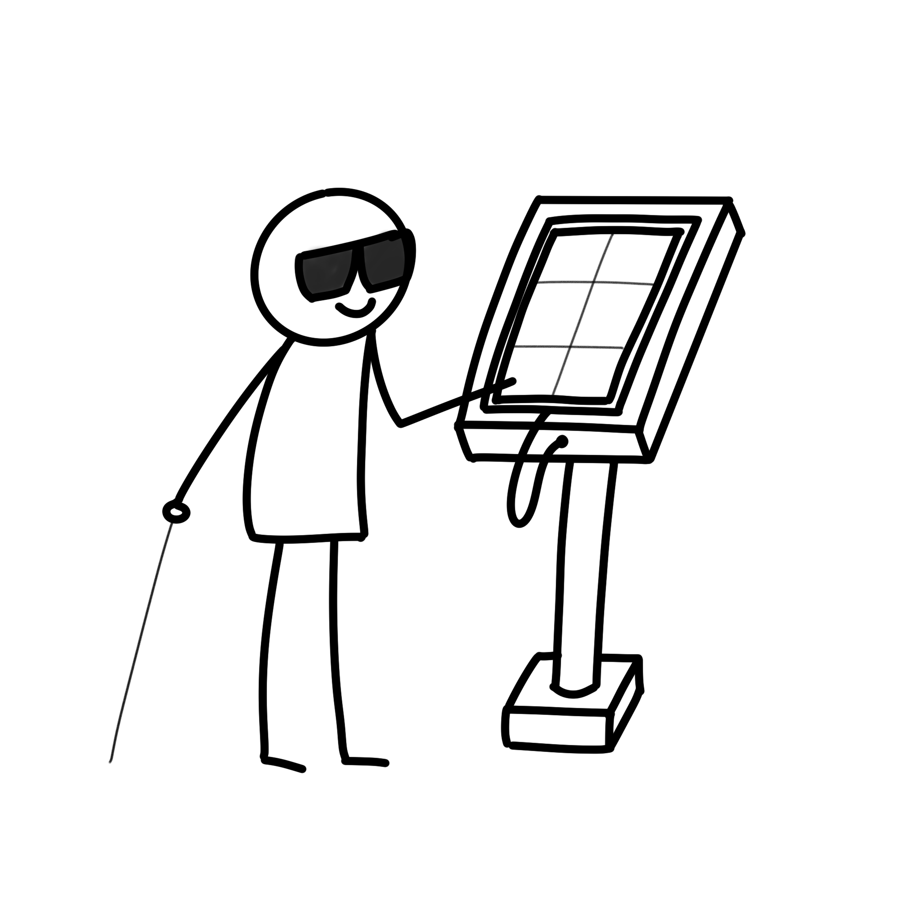
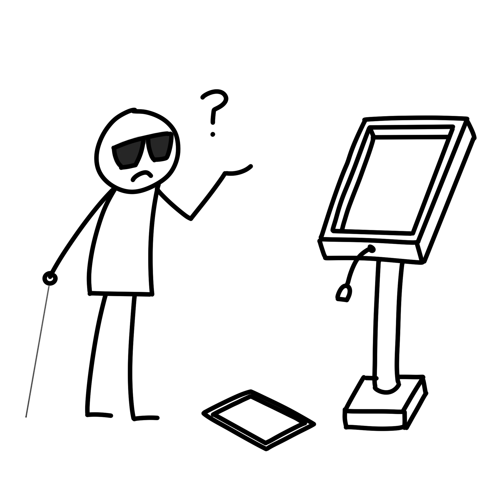

# Barrier Free Kiosk
Human-Computer Interaction (HCI) 팀 프로젝트입니다

# Motivation
오늘날 키오스크의 사용량은 급격하게 증가하고 있습니다  
하지만 사각지대들이 존재하며, 디지털 소외 계층에게는 많은 장벽이 존재합니다  
그래서 저희 팀은 장벽들을 완화하기 위해 몇가지 개념들을 제공합니다

## Note
이 앱은 프로토타입 (실험을 위한 앱) 입니다  
완전히 구현되지 않았으며, 코드나 UI등의 요소가 구현되지 않거나, 불안정할 수 있습니다  

# How to install & use

## 설치
[링크](https://github.com/devhoodit/barrier-free-kiosk-app/releases/tag/0.0.2-beta) - 0.0.2-beta

## 구성
[example_config.json](./example_config.json) 파일을 참고해주세요  
<details>
<summary>Detailed explanation</summary>

```json
{
    "category": [ <- category section
        {
            "title": "category name", <- category name like, pizza pasta beverage
            "items": [0], <- index of items
            "details": [[]] <- detail index for each items
        }
    ],
    "details": [ <- detail section
        [ <- first detail configuration
            {
                "name": "detail name like, nothing", <- first item of current detail
                "price": 0
            },
            {
                "name": "add ice", <- second item of current detail
                "price": 0
            }
        ]
    ],
    "items": [ <-item section
        { <- first item
            "name": "item name", <- item name
            "price": 1000, <- item price
            "images": "image path (relative path)", <- item image path
            "description": "description of item, this will be used in recommendation system" <- item description for natural language processing
        }
    ]
}
```
</details>

## 앱 실행
앱을 설치해주시고, config.json과 image directory를 설정해주세요

## 개발
```powershell
git clone https://github.com/devhoodit/barrier-free-kiosk-app.git
cd barrier-free-kiosk
```
다음과 같은 환경에서 개발중 입니다  
- Flutter 3.8.0-4.0.pre
- Dart 3.0.0 (build 3.0.0-204.0.dev)
- DevTools DevTools 2.21.1
- 13.5 Freeform API 33 (android-x64 emulator)

# 제안
저희팀은 여러가지 문제들을 직면하고, 이러한 문제들을 뒷받힘해줄 근거 자료 "키오스크(무인정보단말기) 이용실태 조사"를 활용하였습니다  

저희의 타겟 유저는 다음과 같습니다  
- 고령층과 디지털 약자 계층
- 시각장애인
- 하지장애인
- 키오스크 구매자 (키오스크 매니저)
- 개발자

저희는 다음과 같은 개념들을 제안합니다
- [Consistency](#consistency)
- [Recommendation System](#recommendation-system)
- [Freedom](#freedom)
- [Restrict](#restrict)
- [Cost](#cost)
- [Compatibility](#compatibility) 
- [Sccability](#scalabilty)

## Consistency
많은 형태의 키오스크가 존재하지만(스탠드, 테이블 등등), 일관성없는 UI 디자인은 사람들에게 혼란이나 불편을 야기할 수 있습니다  
그래서, 일관된 형태의 UI 디자인을 제공합니다  
UI 디자인은 기본적으로 [Material Design Guide](https://m3.material.io/)를 따릅니다  
많은 UI 디자인은 Material Design을 기반으로 디자인 되었기 때문에, 조금 더 친숙한 UI를 제공할 수 있습니다  

## Recommendation System
참고 자료를 보면, 고령층으로 가면 추천시스템(이런 메뉴 어떠세요?)을 선호하는 경향을 띄고 있습니다  
그와 반대로 저연령층으로 갈수록 추천시스템을 선호하지 않습니다  
저희의 목표는 특정 키오스크에서는 저연령층의 접근성을 낮추고, 고령층이나 디지털 약자 계층에 대한 접근성을 높이는 것입니다  
추천시스템을 제공하는 것은 이를 위한 좋은 선택이 됩니다  
이것이 의미하는 바는, 특정 키오스크의 주 사용층을 고령층이나 디지털 약자 계층에 집중시키는 것입니다  
이 추천시스템은 자연어 처리 기술을 활용하여 구현되었습니다 - [링크](https://github.com/devhoodit?tab=repositories)  
*UI 구성또한 이러한 의도를 가지고 구성됩니다  

## Freedom
일반적으로, 키오스크는 어디에 고정되어있는 형태입니다  
테블릿pc를 이용하면, 키오스크는 고정된 형태에서 벗어나, 자유롭게 들고 사용할 수 있습니다  
그러면 왜 키오스크에 자유로운 형태를 주어야 할까요?  
이것은 주로 하지장애인에게 고정된 형태가 아닌 자유로운 형태의 테블릿을 제공함으로써, 행동반경이 제약된 하지장애인에게 자유로움을 선사합니다  

## Restrict
이 개념은 Consistency와 비슷하기도 합니다  
자유에는 책임이 따릅니다  
키오스크 사용자들이 키오스크 사용후 제자리에 두지 않고 떠나는 경우를 생각해봅시다  
이러한 경우, 일반적으로 낮은 UX를 제공합니다  
시각장애인에게는 더욱이 제자리에 있는 키오스크가 중요합니다  
키오스크의 초기 상태를 일관적으로 제공하기위해, 키오스크 사용 과정 중 마지막 과정을 제한합니다  
키오스크의 마지막 과정은 "결제" 입니다  
결제 과정은 오로지 "plugged-in" 상태에서만 작동합니다  
결제 과정이 끝나면, 키오스크는 제자리에 있는 상태입니다   

<details>
<summary>예시 상황 이미지로 보기</summary>




</details>

## Cost
비용또한 Barrier Free Kiosk를 공급하기 위한 중요한 요소입니다  
일반적인 Barrier Free Kiosk는 너무 고가입니다. 이러한 특징은 키오스크 구매자에게 높은 진입장벽을 만듭니다  
하지만 테블릿pc를 사용하면, 기존의 키오스크 (Barrier Free뿐만 아니라 일반적인 키오스크도) 보다 훨씬 싼 가격입니다  
저희의 조사에 의하면, 일반적인 키오스크의 가격은 100~200만원, Barrier Free Kiosk는 2500만원정도 입니다  
테블릿pc는 고작 60만원밖에 하지않습니다 (저희는 samsung tab s7 fe를 사용하였습니다. 더 낮은 가격들의 테블릿들이 많습니다)  
이것은 초기비용(CapEx)에 대해서만 다룬것입니다. 유지비용또한 고려해야합니다  
테블릿은 일상생활에서도 쓰이는, 마치 핸드폰과 같은, 일상적인 물건입니다  
A/S 상황이나, 유지비용또한 합리적입니다  

## Compatibility
안드로이드 플랫폼이나 특정 기기에 국한되지 않기 위해 호환성 또한 중요합니다  
Android, ios, web, pc application과 같은 multi-platform을 지원하는 [Flutter](https://flutter.dev/)를 사용하였습니다  
또한, Flutter는 기본적으로 Material Widget을 제공합니다  

## Scalabilty
특정 키오스크들은 몇가지 작업들을 처리하기 위해 특별한 장치들을 필요로합니다 (지문 인식기 등)  
테블릿pc는 c-type port나 네트워킹이 가능하여, 이를 이용하여 확장가능합니다  
만약, 추가적인 하드웨어 장치가 필요하다면, c-type port를 이용하면됩니다 (또는 네트워킹)  
또한, 테블릿pc는 카메라와 같은 몇몇 하드웨어 장치를 기본적으로 제공합니다  

# How it works
## configuration

# Special Thanks
[@4ch1o3](https://github.com/4ch1o3) - 상황설명을 위한 그림을 제공했습니다